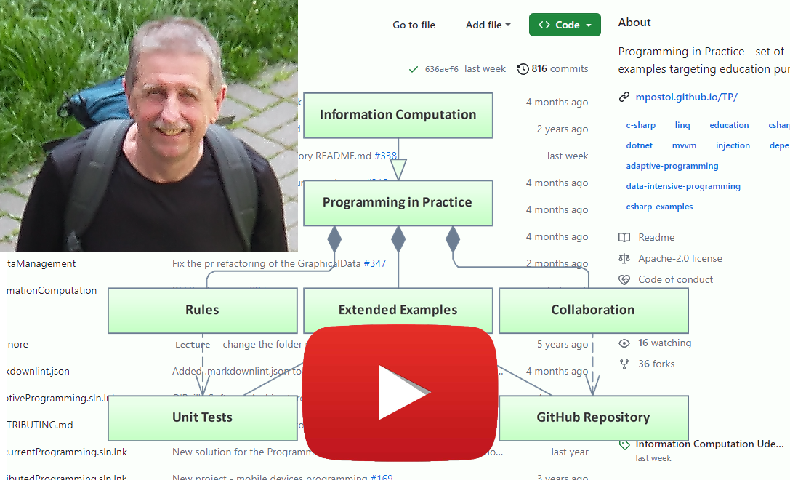

# Hi there 👋

## Programming in Practice Executive Summary

In this short video, I present an executive summary (3 min) of the Programming in Practice educational path. To get more, consider enrolling in [Programming in Practice - Executive Summary; free Udemy course][udemyPiPES]. This free course explains the role of [TP repository hosted on GitHub][TP] as a collection of extended examples that is a foundation for the `Programming in Practice` education path. The course is for all serious about improving the software development skills education methodology including but not limited to teachers and lecturers wanting to improve the software development skills education methodology. It is all about engineering atop University knowledge and practical experience as a foundation. Press the play button to open the video on `YouTube`.

## About

I have a lot of experience in designing and deploying highly distributed applications having managed 100+ innovative projects for industry including aviation, heat engineering, power engineering, and mining. I am the author of the [Object Oriented Internet][OOI] concept, the architect of the [CommServer™][csvr] communication software package for the management and optimization of data transfer, author and architect of the [SmartFactory™][SF] workflow management system and software.

I am engaged in many research projects as a researcher, university teacher, and scientist. I am the author of many publications, lectures, presentations, and training sessions at the Technical University of Lodz (TUL). I have a Master of Electrical Engineering from the Technical University of Lodz and a Ph.D. in Process Control Engineering and Robotics.

For 14 years I have been an active member of the OPC Foundation involved in projects related to the OPC Unified Architecture design, adoption, deployment, and maintenance.

My current goal is to spread my knowledge related to IT solutions. My mission is the education of **Programming in Practice** scoping on many aspects of sequential, concurrent, real-time, and distributed programming.

- 🔭 I’m currently working on **Programming in Practice**
- 👯 I’m looking to collaborate on **External Data Management** and **Concurrent Programming**
- 💬 Ask me about **Programming in Practice**, **Program Engineering**, **IoT**, **Industry 4.0**
- 📫 How to reach me: watch the [**TP repository om GitHub**][TP] or visit my [ebook on **Programming in Practice**](https://mpostol.gitbook.io/pip)
- 👀 Follow me on YouTube to get more on my activity and projects currently I am working on: [Mariusz Postol Profile](https://youtu.be/YPdL0bc0Xmo)

[udemyPiPES]: https://www.udemy.com/course/pipintroduction/?referralCode=E1B8E460A82ECB36A835
[TP]: https://github.com/mpostol/TP?tab=readme-ov-file#programming-in-practice-
[OOI]: https://www.researchgate.net/publication/300338222_Object_Oriented_Internet
[csvr]: https://github.com/commsvr-com
[SF]: https://github.com/CASMPostol/SmartFactory#smartfactory

<!--
**mpostol/mpostol** is a ✨ _special_ ✨ repository because its `README.md` (this file) appears on your GitHub profile.

Here are some ideas to get you started:

- 🔭 I’m currently working on ...
- 🌱 I’m currently learning ...
- 👯 I’m looking to collaborate on ...
- 🤔 I’m looking for help with ...
- 💬 Ask me about ...
- 📫 How to reach me: ...
- 😄 Pronouns: ...
- ⚡ Fun fact: ...
-->
